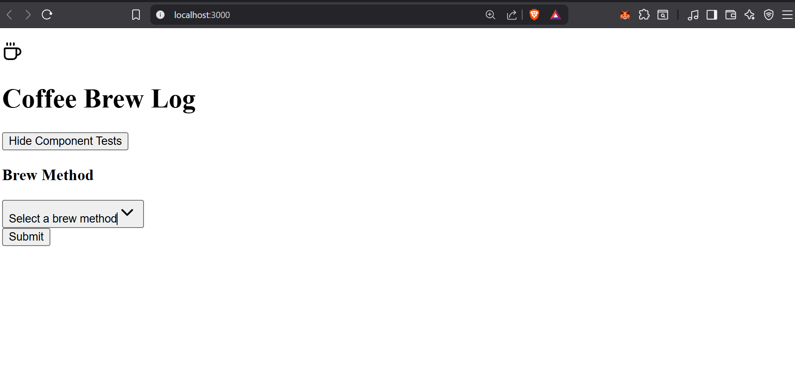

1 completing ui componen system implementation 
2 i will implement components in functional groups of 3, test after each      group to ensure everything works fine 
3 group 1A: core form components 
    select.tsx -  this will be for brew method, grind size selection 
    textarea.txt - for brew notes
    form.tsx - form validating wrapper
4 ctrating testing component

5 group 1B: advance inputs 
    slider.tsx - for rating
    radio-group.tsx - alternative for bre method selection
    checkbox.tsx - for filterting options

